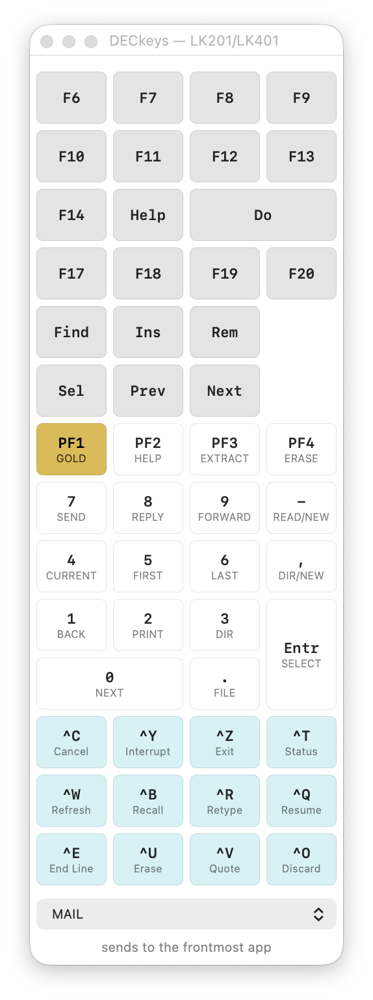

# DECkeys

A floating on-screen **DEC keypad** for macOS. It sends to whatever application
is frontmost — like the built-in Accessibility Keyboard, but for the keys a
modern laptop doesn't have and a VT terminal expects: **PF1–PF4 (Gold)**, the
numeric keypad, **Find / Insert Here / Remove / Select / Prev / Next**, and
**F6–F20** including **Help** and **Do**.

It works with anything that reads a terminal: `telnet`, `ssh`, iTerm2,
Terminal.app, and terminal *emulators* such as
[ezalb](https://github.com/tenox7/ezalb) — which runs real VT420 firmware, and
passes these sequences straight through to the guest behind it.

Written to make EDT, EVE and VAX Notes usable on OpenVMS from a laptop with no
numeric keypad.

<p align="center">
  
</p>

*The panel with the MAIL overlay selected — each cap shows what VMS MAIL does
with that key. The teal keys at the bottom are conveniences, not LK201
hardware.*

## Build and run

```sh
./make-cert.sh     # once — creates a local code-signing identity (see below)
./build.sh
open DECkeys.app
```

Requires the Xcode command line tools. No Xcode project, no dependencies —
one Swift file and a shell script.

**Grant Accessibility** on first run: System Settings → Privacy & Security →
Accessibility. Posting synthetic key events is privileged.

## How it works

DECkeys types **escape sequences**, not keycodes. Clicking PF1 presses ESC, then
Shift-O, then Shift-P as genuine key events — indistinguishable from a person
at the keyboard, which is why every client accepts it.

The alternative — posting the Mac keypad keycode that sits in the same physical
position — **does not work**, and it's worth knowing why. An Apple keypad's top
row (Clear, `=`, `/`, `*`) is exactly where an LK201 puts PF1–PF4; DEC's layout
is where the PC world later put Num Lock and the operators. But the *protocol*
never followed the plastic. A terminal reads those keys as themselves — literal
`=/*` in numeric keypad mode — and doesn't transmit Clear at all. There is no
Mac keycode a terminal turns into PF1.

## The profile

Layout, key codes, sizes and legends all live in `profile.json`, read at launch.
**Adding or changing keys needs no rebuild.**

```json
{ "label": "PF1", "row": 6, "bytes": "\\eOP" },
{ "label": "Do",  "row": 2, "bytes": "\\e[29~", "span": 2, "dark": true }
```

`\e` is ESC; also `\r`, `\n`, `\t`, and `\cZ` for Ctrl-Z. `col` and `span` and
`rowspan` place a cap on the grid — the numeric keypad's `0` is double-wide and
`Enter` double-high, as on the hardware. `dark` paints the darker grey DEC
moulded the function row and editing keypad in; `conv` marks a key that is *not*
LK201 hardware but a convenience, and tints it so the panel never pretends
otherwise.

## Overlays

DEC printed a second legend on each keycap saying what the *application* did
with it. Those legends are application-specific — the same KP4 sends `ESC O t`
whichever program is running, but it is `ADVANCE` to EDT, `Word` to WPS-PLUS and
nothing at all to VAX Notes.

So legends are **sets**, chosen from the popup at the bottom of the panel:

- **None** — the bare hardware. PF1 is just PF1.
- **EDT** — the EDT editor, from figure ZK-1688-84.
- **EVE-EDT** — EVE's *emulation* of the EDT keypad, from EVE's own `GOLD-HELP`
  diagram on a live OpenVMS system. Deliberately separate: EVE renames
  CUT/PASTE to Remove/Insert Here and ADVANCE/BACKUP to Forward/Reverse, so
  the same key means different things depending on which you are running.
- **MAIL** — VMS MAIL, from figure ZK-1744-84. Every key has a Gold function.
- **NOTES** — VAX Notes, from *Introduction to VAX Notes* figure ZK-4673-85.

Hover a cap for the Gold-shifted function and the unabbreviated wording.

Gold is a property of the **set**, not the key, so PF1 is only gold when an
overlay is selected whose application treats it as a prefix.

Adding an overlay is a JSON edit — see [AGENTS.md](AGENTS.md), which is written
for exactly that job. Every one of these applications documents itself on screen
(`GOLD-HELP` in EVE, `HELP KEYPAD` in EDT, PF2 in Notes) and DEC's manuals are
on bitsavers; both are far better sources than anyone's memory.

## Keys deliberately absent

- **F1–F5** are *local* keys on a DEC terminal: Hold Screen, Print Screen,
  Set-Up, Session, Break. The firmware acts on them and transmits nothing.
  There is no escape sequence for F1.
- **Compose and Lock** are likewise keyboard-level (`LK201_SK_META` and
  `LK201_SK_LOCK`, each with its own LED). The host never sees them.
- **Arrow keys** are omitted because your laptop has them — and Gold still
  works with them, since the panel's Gold is a real keystroke.

## Notes for anyone hacking on this

Five things cost real time and are not obvious:

- **Do not sign with `--options runtime`.** The Hardened Runtime blocks
  synthetic event posting without specific entitlements, and the failure is
  silent — every button simply stops working.
- **Ad-hoc signing makes every rebuild a new app to macOS.** The designated
  requirement becomes a hash of the binary, so the Accessibility grant is
  dropped on every build. `make-cert.sh` creates a stable self-signed identity;
  the requirement becomes `identifier … and certificate leaf …` and survives.
- **`CGEvent.keyboardSetUnicodeString` loses to the keyboard layout.** With a
  real event source macOS re-translates the virtual keycode and that wins —
  keycode 0 is `a` on a US layout, so every button typed "a". A `nil` source
  didn't fix it either. Pressing the real keys does.
- **Control must be genuinely held**, not merely asserted in the event's flags.
  Shift survives flags-only because the character is derived from keycode+shift,
  but a client reading modifier *state* sees no Control unless a `flagsChanged`
  event says so. Ctrl-Z reached nothing until DECkeys pressed `kVK_Control`.
- **`.rounded` NSButtons ignore `bezelColor`** in current appearances *and*
  draw a fixed-height bezel inside whatever frame you give them, so a
  custom-coloured cap ends up a different size from its neighbours. All caps
  here are drawn directly.

Launch with `open --stderr /tmp/deckeys.log DECkeys.app` to see the startup
diagnostics — trust state, which profile loaded, panel geometry, and a hex dump
of the bytes every key will send. Running the
binary from a shell instead reports the *terminal's* Accessibility state, not
the app's.

## Sources

- [Shuford Terminal Information Archive](https://vt100.net/shuford/terminal/key_mice.html) — LK201/LK401 hardware reference
- *Introduction to VAX Notes*, Figure 1–1 — the Notes keypad
- [ezalb](https://github.com/tenox7/ezalb) — VT420 firmware emulator, used to verify what each key actually transmits

## License

GPL-2.0. See [LICENSE](LICENSE).
